# DEVSTACK


---

An interactive, GUI-driven orchestrator designed to build modular Adobe Commerce environments for monolithic or headless development.
Easily toggle between optional services, monitor performance, and manage your entire local infrastructure from a single interface.

<div align="left">
  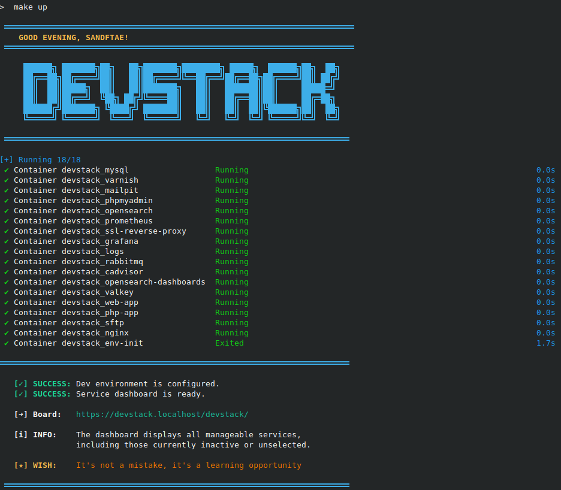
</div>

---

## Devstack gallery

<details>
<summary> Click for a quick visual overview</summary>
<br/>
  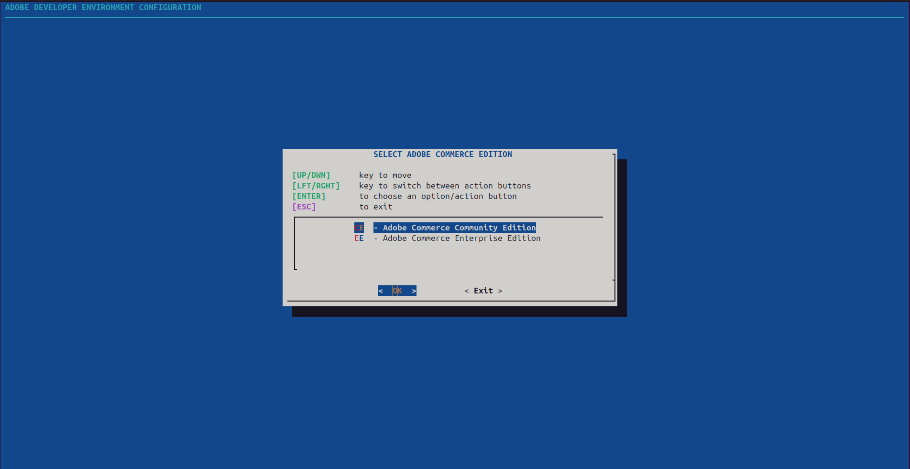
  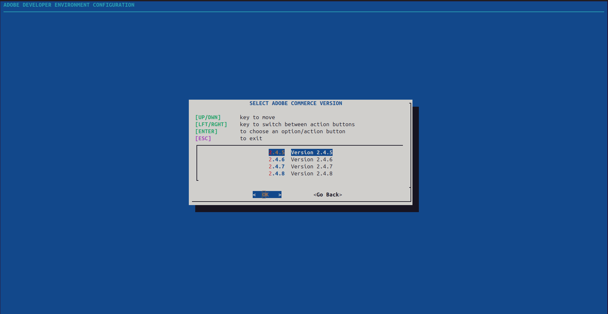
  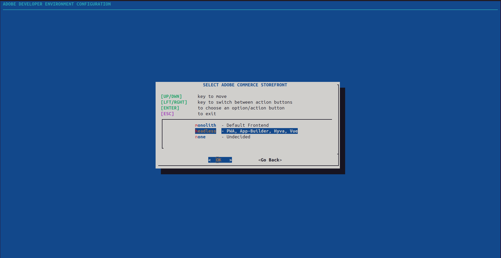
  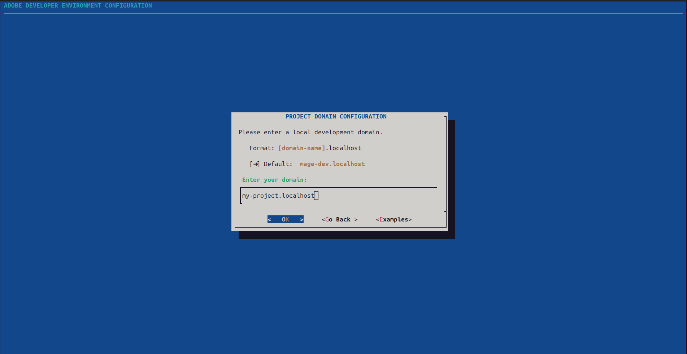
  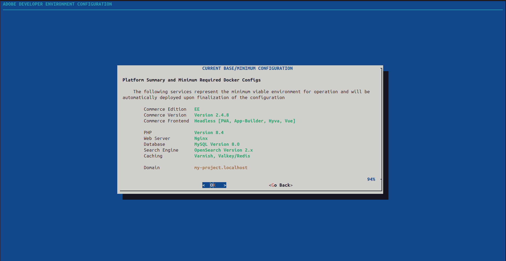
  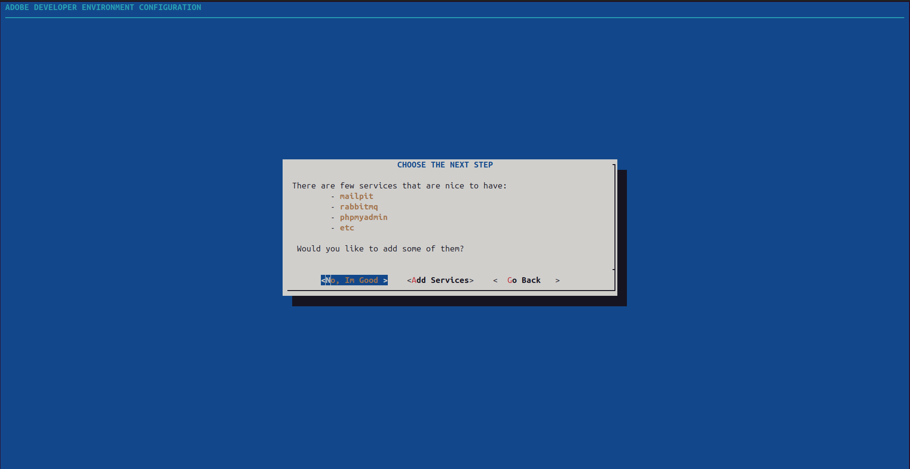
  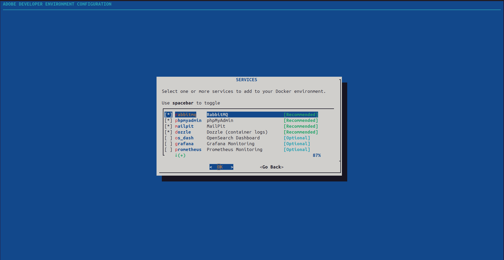
  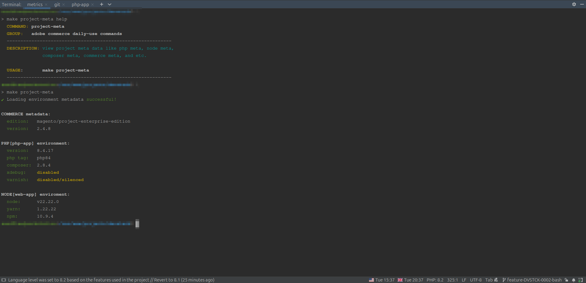
  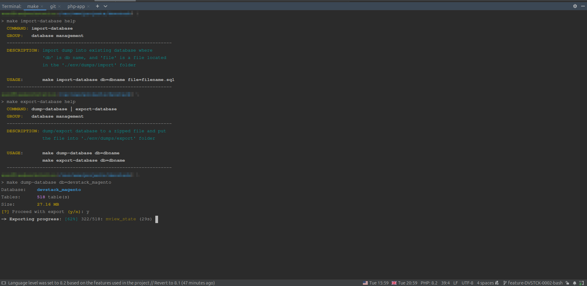
  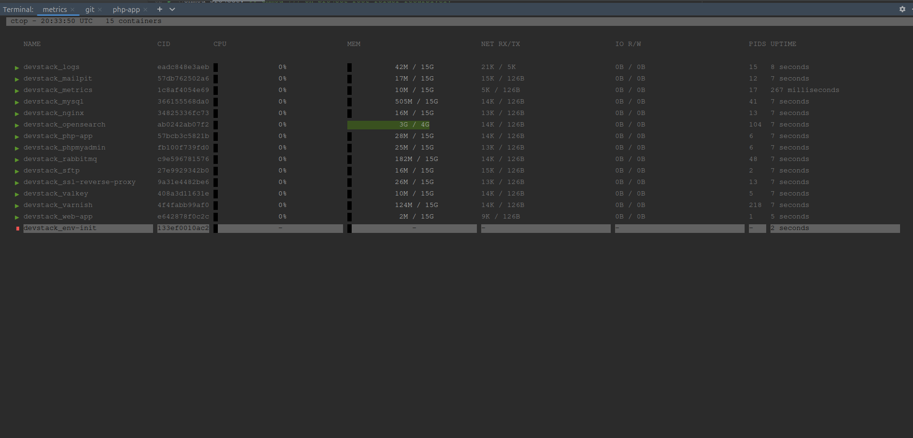
  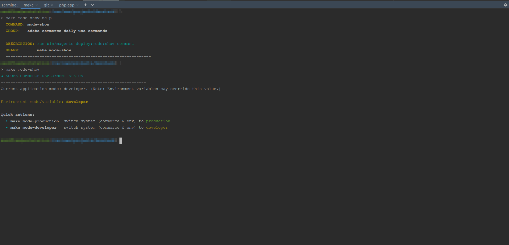
  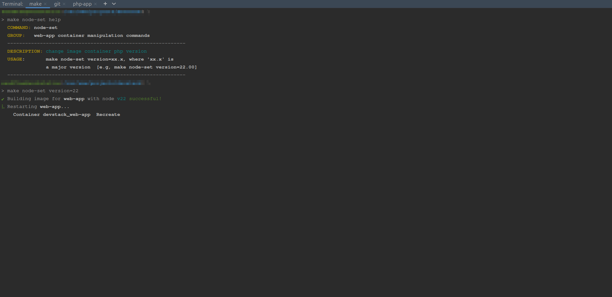
  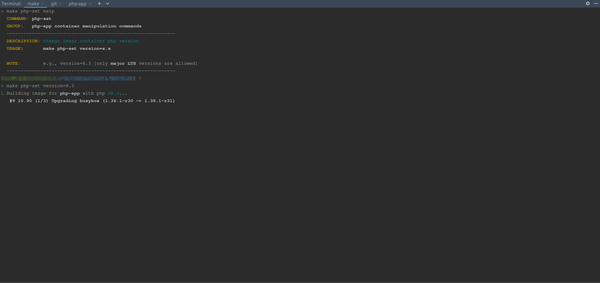
  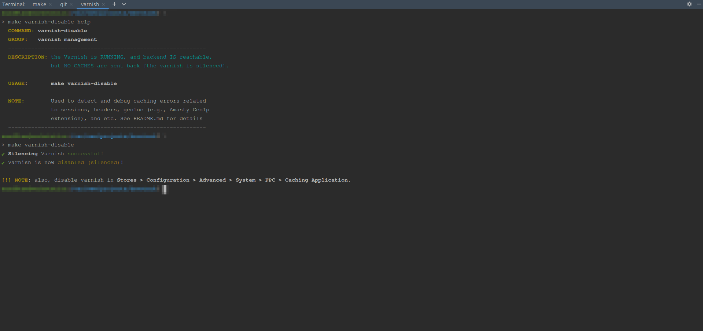
  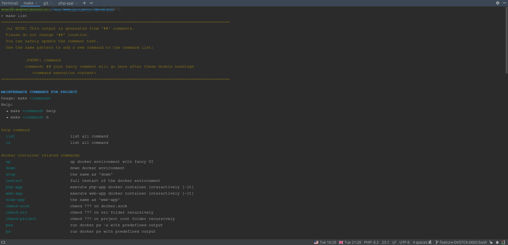
  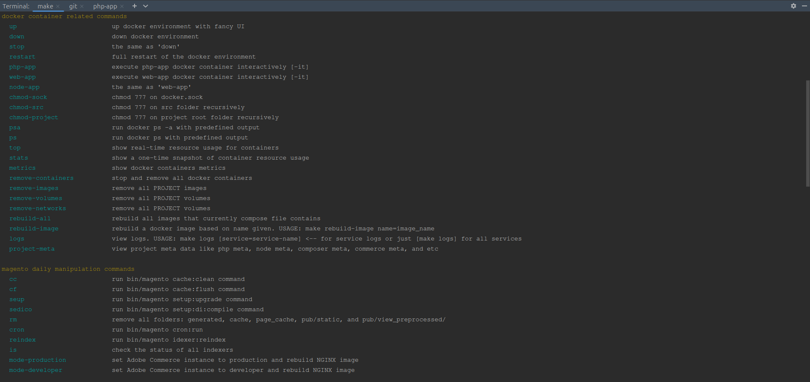
  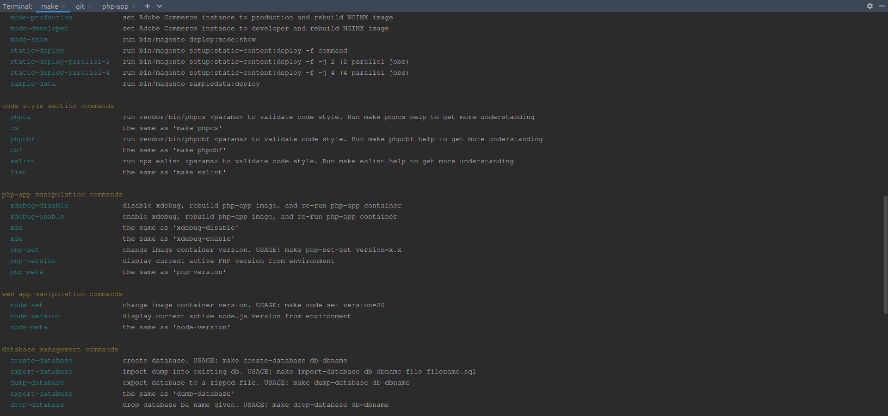
  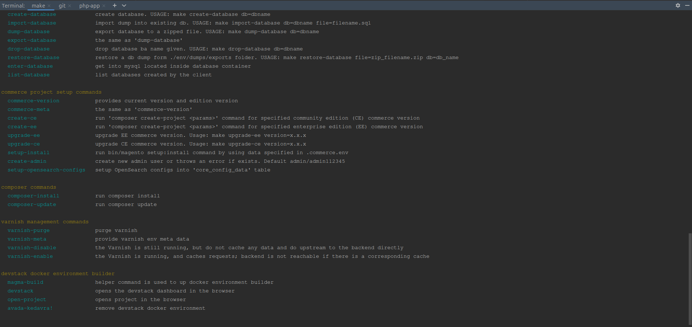
</details>

---

## 📖 Table of Contents
- [About](#about)
- [Key Features](#key-features)
- [Available Services](#available-services)
- [Getting Started](#-getting-started)
    - [Prerequisites](#prerequisites)
    - [Infrastructure Installation](#infrastructure-installation)
    - [Adobe Commerce Installation](#adobe-commerce-installation)
- [Usage](#-usage)
- [Database Import/Export](#database-importexport)
- [Accessing the DEVSTACK](#-accessing-the-devstack)
- [Default Credentials](#-default-credentials)
- [Debugging & Performance](#debugging--performance)
    - [Xdebug](#xdebug-configuration)
    - [Varnish and Adobe Commerce Modes](#varnish-and-adobe-commerce-modes)
- [Project Structure](#-project-structure)
- [Troubleshooting](#troubleshooting)
- [License](#-license)

---

## Overview
**DEVSTACK** is a bash-powered orchestration tool designed specifically for Adobe Commerce developers. Instead of a "one-size-fits-all" approach, this tool uses an interactive **Bash GUI** to help you build a dev environment tailored to your specific project needs.

It handles the complex networking and service dependencies required for Adobe Commerce development, including support for headless frontends.

## Compatibility Matrix
For a full breakdown of which PHP, MySQL, OpenSearch, etc. versions are paired with each Adobe Commerce version, please refer to the **[Service Compatibility Guide](COMPATIBILITY.md)**

## Key Features
* **Interactive GUI:** select services via dialog GUI
* **SSL (HTTP/HTTPS):** automatically generated SSL certs that allows to test app over `https://` locally
* **Version-Specific:** configure compatible versions of services based on targeted Adobe Commerce version
* **Headless Isolation:** `php` and `node` apps are kept in separate containers
* **Headless Configuration:** allows to easy change `node` versions
* **On-Demand Modes:** toggle between `developer` and `production` app modes to test Varnish bugs
* **Telemetry & Monitoring:** Grafana, Prometheus, and cAdvisor for `play-around` testing 
* **Developer Utilities:**
    * **SFTP Server:** local SFTP access to test Adobe Commerce crons and third-party modules syncs
    * **Centralized Logging:** aggregate logs from all containers into a single searchable view
    * **Env-Init:** resolves Linux permission mismatches between host and the Docker containers
* **Service Dashboard:** **DEVSTACK** service Dashboard to address direct links to active services GUIs

---

## Available Services
**DEVSTACK** consists of over 15 services. While the core services are required, many components like monitoring and headless tools ``are optional``

 **Please, view the full service list available** **[here](docs/github/mds/SERVICES.md)**

---
> [!CAUTION]
> ### Development Limitations
> This tool is created specifically for **local development and testing**. It contains configurations designed for debugging, performance monitoring, and are **not secure** for production or staging.
>
> ### Infrastructure vs. Application
> This tool builds the **"house"** (the services, etc). You are responsible for bringing the **"furniture"**. It means cloning your source code, managing `auth.json` credentials, and etc.

---

## Getting Started

### Prerequisites
* **Good Mood**: We are living in tough time. Let's try to keep our thoughts clear and open to the beautiful
* **OS:** Linux (Ubuntu recommended) version 24.04 or higher LTS. The tool was not tested with MacOS/Windows, but it was written to be capable to work with those OS
* **Docker:** Docker Engine 20.10+ and Docker Compose v2
* **Utilities:** `make`, `bash`

--- 

## Infrastructure Installation
1. **Clone the repository**
    ```bash
    git clone https://github.com/sandftae/devstack.git
   
    cd devstack
    
   # optional cleaning action; be sure you are ONLY deleting devstack`s 
   # git service files/folders, and devstack`s *.md files  
   rm -rf *.md LICENSE .editorconfig .git .gitigonre .editorconfig docs/github
    ```

2. **Launch the DEVSTACK GUI**
    ```bash
   make magma-build 
   ```

> [!NOTE]
> 
> Once the environment build is complete, you will see that several new files and folders [have been added](#-project-structure)

---

## Adobe Commerce Installation

The **DEVSTACK** provides a `development environment`, but you need to fill in the project source code yourself.

> [!IMPORTANT]
> 
> All installation-related manipulations will be performed based on the Commerce version specified during setup.

---

### ``cloned/existing adobe commerce project installation``


0. **Start Environment**

Before go further, lets start docker environment if not yet:

```shell
make up
```

1. **Import Database**

See [this](#database-importexport) for more details


2. **Backend**

    - get into the PHP container
    ```bash
    make php-app
   ```
    - clone your project repository **inside** the container and run composer
   ```bash 
   # at the Makefile level
    make composer-install
    ```
    - run the install command to populate the database
    ```bash
      # at the Makefile level
      # this command configure urls, admin, etc
      make setup-install
    
      # change commerce mode to developer  
      make mode-developer
      # or 
      make mode-production  
      
      # use "make mode-show" command to see current commerce mode and docker environment mode  
      ```
    - default admin/pass is ``admin/admin12345``, run this command to set your own:
   ```bash
      make create-admin
   ```

2. **Frontend (default / monolith)**
    - default Adobe Commerce frontend is located in the ``php-app`` folder


3. **Frontend (headless)**
    
    - enter the ``web-app`` container
    ```bash
    make web-app 
   ```
   
    - ``clone`` the web project and run ``npm/yarn deploy commands``

---

### ``fresch adobe commerce project installation``
if you re going to use fresh commerce ``EE/CE`` then the flow is the following:
```bash
 # up docker environment
 make up
 
  # for CE version; specified during configuration version of the CE will be used
 make create-ce
 
 # for EE version; specified during configuration version of the EE will be used
 make create-ee
 
 # set the database in the alignment with commerce edition and version 
 make setup-install
````

--- 

### ``node`` version upgrade/downgrade

The ``web-app`` container is packed with the ``node v.20``.  If you need to ``upgrade/downgrade`` version run this command:
```shell
# major node version like 16, 18, 20, etc.
make node-set version=MAJOR_NODE_VERSION
```

> [!IMPORTANT]
> 
> node version must be changed only by using ``make node-set version=MAJOR_NODE_VERSION`` command

---

##  Usage
| Base commands        | Description                         |
|----------------------|-------------------------------------|
| ``make up``          | start the docker environment        |
| ``make down``        | stop and shutdown the environment   |
| ``make php-app``     | enter PHP-app container             |
| ``make web-app``     | enter Web-app container             |


### `help`
Each command has a `help | h` flag, e.g.:
```shell
make list h
make help

make create-ce h
make create-ce help
```

See this list of all existing commands: [click](docs/mds/COMMANDS.md) or run this in your terminal:
```bash
    # show command mets
    make list help
    
    # run this command to list l commands
    make list
```

---

## Database Import/Export

The default Adobe Commerce database is **devstack_magento**. It is created automatically by the `mysql` container. Keep reading to see how to do `create|drop|import|export` database operations yourself.

The **DEVSTACK** provides a robust system for handling Adobe Commerce data, split between **Automated Initialization** and **Manual CLI Import/Export**.

> [!NOTE]
> All SQL files are managed within the `env/dumps/` directory

---

### Automated Seeds (Initialization)
The system **"seeds"** (auto-populate) your database using files in `env/dumps/seed/` under two conditions:

- **the `first run` rule**: This triggers only when the MySQL container is created for the first time
- **the `empty volume` rule**: the `env/volume/mysql` directory must be empty

> [!NOTE]
> 
> **How to Re-Seed?**
> 
> If you need to force the automated import to run again:
> - `make down`
> - `sudo rm -rf env/volume/mysql`
> - `make up`
> 
> **Where is the seeded data stored?**
> - it is imported into the default ``devstack_magento`` database


#### Quick Start or Onboarding strategy for the team(s)
This mechanism is ideal for `sharing a pre-configured `environment with team members. Simply place
a database dump in `env/dumps/seed/` before distributing the env repository. When a new developer runs make `make up`,
they will have a fully populated database without any manual import steps.

> [!IMPORTANT]
>
> **THE "SILENT" SEEDING PROCESS**
>
> The official MySQL Docker image do NOT provide a real-time progress bar or UI notifications. This may be confusing because once you run env the mysql container is
> up and no database import progress bar is shown. So, once you're seeding the database you need to track the process itself. Just check db size once in minute to see db size actually increasing.
> 
> #### Use manual import if you want to have more control over import
---

### Manual CLI Import/Export (Makefile)
Use these commands for daily development tasks like importing dumps, creating backups, or creating new database.

> [!NOTE]
> the `file=` parameter looks inside `env/dumps/import/`

| Command                                          | Description                                           |
|:-------------------------------------------------|:------------------------------------------------------|
| `make create-database db=db_name`                | creates a new database if it doesn't exist            |
| `make drop-database db=db_name`                  | delete database                                       |
| `make import-database db=db_name file=dump.sql`  | imports a specific dump into the database             |
| `make dump-database db=db_name`                  | exports a compressed `.sql.gz` to `env/dumps/export/` |

**Examples**

- #### import after the environment is up (`make up`):

```shell
# 1. create the schema
make create-database db=staging_db

# 2. import (file must be in env/dumps/import/)
make import-database db=staging_db file=staging-dump_bak.sql
```

- #### dump database before performing database-not-safe tests:
```shell
# this creates a compressed .gz backup in env/dumps/export/
make dump-database db=staging_db
```

---

### Database Folder Purposes

| Folder Path         | Usage         | Behavior                                                     |
|:--------------------|:--------------|:-------------------------------------------------------------|
| `env/dumps/seed/`   | **automatic** | scripts run on env **first-boot**                            |
| `env/dumps/import/` | **manual**    | place external dumps here to use with `make import-database` |
| `env/dumps/export/` | **manual**    | destination for dumps created via `make dump-database`       |

---
## Accessing the DEVSTACK

Once the containers are running, you can access the various parts of the environment using the URLs below.

### Storefronts & Backend
| Service                  | Local URL                                             | Note                              |
|:-------------------------|:------------------------------------------------------|:----------------------------------|
| **Monolith Frontend**    | https://your-domain.localhost/                        | Default Adobe Commerce storefront |
| **Adobe Commerce Admin** | https://your-domain.localhost/admin                   | Use your custom admin url         |
| **Vue Storefront**       | https://lyour-domain:3000/ <br/> http://0.0.0.0:3000/ | Default Vue storefront            |
| **PWA Studio**           | https://lyour-domain:3000/ <br/> http://0.0.0.0:3000/ | Default PWA storefront            |


### EVSTACK Service Dashboard
| Service                 | Local URL                                                                      |
|:------------------------|:-------------------------------------------------------------------------------|
| **Service Dashboard**   | [https://your-domain.localhost/devstack/](https://dev-env.localhost/devstack/) |

> [!TIP]
> 
> **The Service Dashboard** contains direct links to all active service GUIs

**The Service Dashboard** view:

<div align="center">
  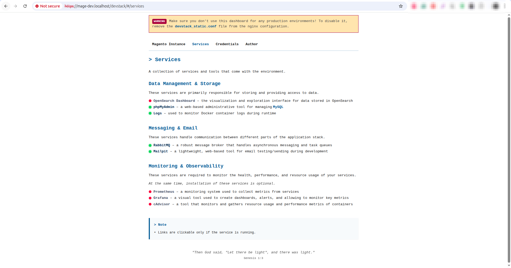
  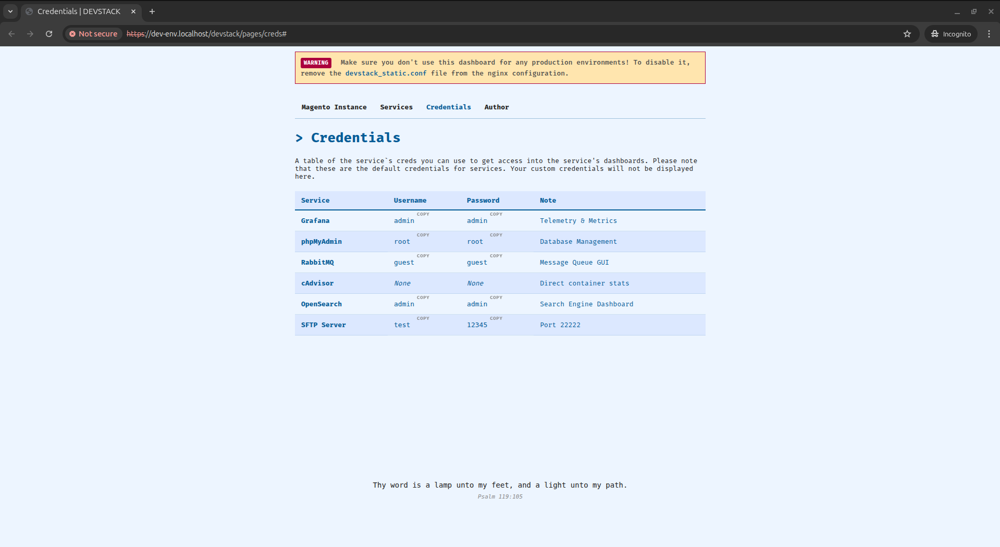
</div>

---

## Default Credentials

Use the following credentials to access the administrative panels of the included services.

| Service         | Username | Password | Note                    |
|:----------------|:---------|:---------|:------------------------|
| **Grafana**     | `admin`  | `admin`  | Telemetry & Metrics     |
| **phpMyAdmin**  | `root`   | `root`   | Database Management     |
| **RabbitMQ**    | `guest`  | `guest`  | Message Queue GUI       |
| **cAdvisor**    | *None*   | *None*   | Direct container stats  |
| **OpenSearch**  | `admin`  | `admin`  | Search Engine Dashboard |
| **SFTP Server** | `test`   | `12345`  | Port `22222`            |

> [!IMPORTANT]
>
> **Database Access:** For external tools  the MySql port is `3309`

---

## Debugging & Performance

---

### Xdebug Configuration

*Xdebug* configuration covers only `PHPStorm` at this moment. Please, use this [reference](docs/github/mds/XDEBUG.md) to, actually, **configure** your `PHPStorm`

---

### Varnish and Adobe Commerce Modes

The Varnish service is always enabled to maintain architectural consistency. The `varnish` container has two modes that are helpfully for `debugging` purposes.

#### Silence Mode:
 - Varnish is `"silenced"`. The service remains active, but it passes all requests directly to the backend without caching data

#### Unsilence Mode:
 - Varnish is fully `active`. It processes and cache data; the backend is reached if no valid cache exists for the request


#### `Silence mode` technical details 

This mode is also known as `Cache Bypass` or `Direct Backend Routing` mechanism. This allows you to run the application
in a full `production mode` (with `Adobe Commerce` generated files) while **forcing Varnish to bypass the cache**. 
This is essential for debugging backend-specific logic, like:
   - `geo-ip resolution`
   - `session handling`
   - `header-based redirects`
   - `store-switching logic`,
 
 that would otherwise be masked by a cached response.

---

<div align="center">
  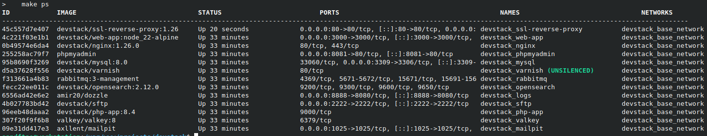  
  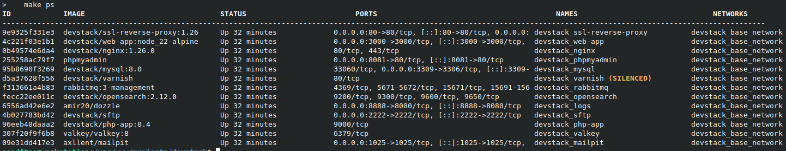
</div>

---

#### Mode Control Commands

To switch mode logic, use the following commands:

| Commerce mode                         | Command                                 | Result                                                                                                                              | Silence Headers                 |
|:--------------------------------------|:----------------------------------------|:------------------------------------------------------------------------------------------------------------------------------------|:--------------------------------|
| **production**<br/> and **developer** | `make varnish-disable`                  | `varnish is silenced`: direct backend access (no caching)                                                                           | `X-Varnish-Bypass: true`        |
| **production**<br/> and **developer** | `make varnish-enable`                   | `varnish is fully active`: processes and caches data                                                                                | `X-Varnish-Bypass` not provided |

---

### ``X-Varnish-Bypass`` 

> [!WARNING] 
> 
> Keep in mind that the ``X-Varnish-Bypass`` flag is **DEVSTACK** specific/custom variable

When you are in **varnish silence mode**, you can verify if the bypass is active by inspecting the headers of any request.

Look for the `X-Varnish-Bypass` parameter in the global server variables or response headers:

 - `X-Varnish-Bypass: true` — varnish `is silenced`. The request was passed directly to the PHP-FPM/Nginx backend

 - `X-Varnish-Bypass` missed — varnish `is not silenced`. The request is being handled by the caching layer

On backend you can check the bypass status by looking for the `X-Varnish-Bypass` parameter in the global `$_SERVER` variable:

```php
if (
    isset($_SERVER['HTTP_X_VARNISH_BYPASS']) && 
    $_SERVER['HTTP_X_VARNISH_BYPASS'] === 'true'
) {
    # varnish is currently silenced/bypassed ----> do debugging
    # REMEMBER THIS IS FOR DEVELOPMENT PURPOSES ONLY AND SHOULD
    # NOT BE USED IN PRODUCTION OR TEST ENVIRONMENTS!
}

```

---

##  Project Structure

```shell
├── docs/                       # Knowledge folder: put here project-related files you would like to store
├── env/                        # GUI logic, .env file, and Docker templates
│   ├── bash/                   # Devstack service manipulation and manage commands
│   ├── etc/                    # Build and runtime docker service configs
│   ├── dumps/                  # Database management root
│   │   ├── export/             # Destination for 'make dump-database'
│   │   ├── import/             # Source for 'make import-database'
│   │   └── seed/               # Automated init scripts (docker-entrypoint)
│   ├── image/                  # Devstack service images
│   ├── static/                 # Service dashboard static files
│   ├── volume/                 # Persistent container data (MySQL, Redis, etc.)
│   ├── .env                    # Main configuration file
│   ├── compose.common.yml      # Common services
│   ├── compose.env-build.yml   # Devstack environment builder configuration. DO NOT REMOVE
│   ├── compose.php.yml         # Only php container
│   └── compose.yml             # Orchestration file
├── logs/                       # Nginx, Web-app, and PHP-FPM logs
├── src/
│   ├── php-app/                # Adobe Commerce Source Code (PHP)
│   └── web-app/                # Headless Source Code (Node.js)
├── Makefile                    # Core Base commands
└── README.md
└── ROADMAP.md
└── LICENSE
└── .editiorconfig
└── .gitignore
```
---

## Troubleshooting

---

### Error 503 Backend fetch failed
This is the common varnish error. It usually means `Varnish` lost the connection to the Adobe Commerce (Nginx) backend or the backend timed out during a heavy process.

#### Symptoms:
 - a plain white page with the text: `Error 503 Backend fetch failed`
 - varnish is running, but it cannot communicate with the PHP containers

#### Resolution
The fastest way to reset the connection bridge between the cache layer and the application is to restart the environment:
```shell
make down
make up
```

---

### Permissions & Ownership

A common issue with Docker environments is the **permission denied** error, which occurs because many containers run as the
`root` user while your local host uses a standard one (usually, `1000:1000`).

**DEVSTACK** implements an automated permission-handling logic to bridge this gap, ensuring that the services and a user
have access to critical files and folders. The tool automatically synchronizes `read/write` permissions for the following directories:
 - `src/web-app`
 - `src/php-app`
 - `env/.env`
 - `env/*.yml`
 - `logs`

For security and data integrity reasons, **DEVSTACK** does not manage permissions for the following folders:
 - `volumes`
 - `env/volumes`
 - `env/dumps`
---

## 📘 Documentation

Refer to [INSIGHTS.md](INSIGHTS.md) for architectural decisions and performance benchmarks.

Refer to [SHOWCASES.md](SHOWCASES.md) for a visual representation of the tool.

---

## 📄 License
This project is licensed under the MIT License - see the [LICENSE](LICENSE) file for details.
