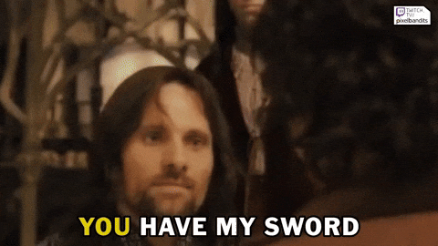
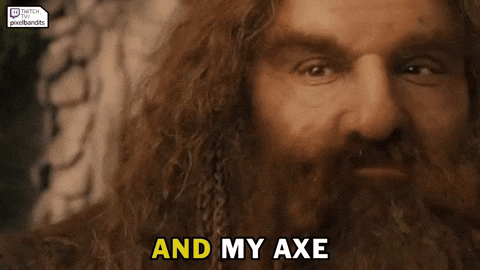
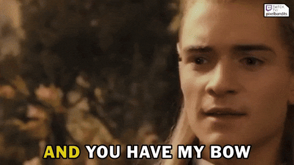

# Support

If you run into issues with **DEVSTACK**, here is how you can get help.

### Before Asking
Since this is a personal project, please check these resources first:
* **Documentation:** re-read the `README.md` and `INSIGHTS.md`
* **Troubleshooting:** check the `Troubleshooting` section in the main `README.md`

### How to Get Help
If you still need assistance:
* **Direct Contact:** you can reach out to me directly. Check my GitHub profile page for contact details

Please keep in mind that as a `one-dev project`, my response time may vary. 

#### I appreciate your patience! Thank you!

 

---

  
  
  
  

---
