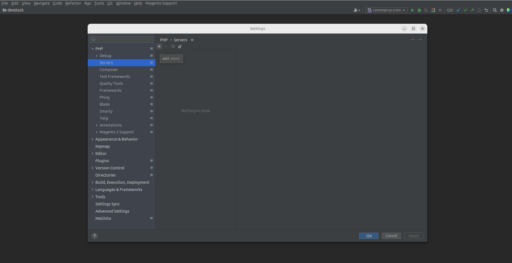
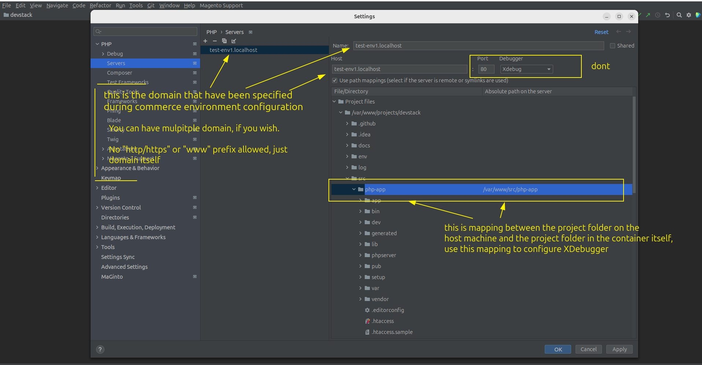

# Xdebug Configuration Guide

This guide describes how to configure `Xdebug` for both `HTTP/HTTPS requests` and `CLI` commands (cron/console).

> [!NOTE]
> 
>   - this setup uses a `direct-to-IDE` approach, so `no browser extension needed`
>   - once it is done both `http/https request` and `CLI` are debuggable

---

## Table of Contents
- [Manage Commands](#manage-commands)
- [XDebug Configuration](#xdebug-configuration)
- [How to Start Debugging](#how-to-start-debugging)

---

## Manage Commands

Use these `make` commands to control the Xdebug status within your container.

| Command               | Alias      | Description                        |
|:----------------------|:-----------|:-----------------------------------|
| `make xdebug-enable`  | `make xde` | enables Xdebug `in the container`  |
| `make xdebug-disable` | `make xdd` | disables Xdebug `in the container` |


---

## XDebug Configuration

Configuration consists of three steps: 
 - `Debug/Proxy services`
 - `PHP Interpreter Configuration`
 - `Server Path Mapping`

### I. PHPStorm Debug and DBGp Proxy
Configure the ports and proxy settings to allow `PHPStorm` to listen for `incoming` connections.

<details>
<summary>👉 Setup Steps</summary>
<p align="center">
  
  
</p>
</details>

### II. PHP Interpreter Configuration
To ensure proper communication between the `host` and the `php-app` container, you must configure the `remote interpreter` and the `php-app container`.

> [!IMPORTANT]
> 
> Ensure the `PHP Interpreter` version you selected matches your `Adobe Commerce` version (e.g., PHP 8.4 for AC v2.4.8, etc). The interpreter should point to the `php-app` container`s image.

#### STEP 1: PHP Interpreter
Connect `PHPStorm` to the Docker `container's php-fpm`.
<details>
<summary>👉 Setup Steps</summary>
  
  
  
  
</details>

#### STEP 2: Containers

Align path mappings so `PHPStorm` can map the file structure `inside the container`.
<details>
<summary>👉 Setup Steps</summary>
  
  
</details>

### III. Server Path Mapping

This configuration **tunnels** `PHPStorm` with the `php-fpm` inside container and `vice versa`.

> [!NOTE]
>
> The `Server Name` **must** match your `domain` name specified for `commerce instance` during environment configuration
> (e.g., mage-dev.localhost).
> 
> Run this command to get it:
> ```bash 
> make project-meta
>```

<details>
<summary>👉 Setup Steps</summary>
  
  
</details>

---


##### Done. No more configurations needed. Both `HTTP/HTTPS Requests` and `CLI` commands are debuggable now

---

## How to Start Debugging

1. **Set breakpoints:** add breakpoints where needed
2. **Enable Xdebug** in the terminal:
    ```bash
    make xde
    # or 
    make xdebug-enable
    ```
3. **Start Listening:** click the `Start Listening for PHP Debug Connections` icon in PHPStorm (the `phone` icon)
4. **Run incoming request:** refresh your browser page to trigger `HTTP/HTTPS` request
5. **Run CLI:** e.g., `bin/magento cron:run` or `custom` one 
6. **Disable Xdebug** in your terminal:
    ```bash
    make xdd
    # or 
    make xdebug-disable
    ```
