# Xdebug Configuration Guide

This guide describes how to configure `Xdebug` for both `HTTP/HTTPS requests` and `CLI commands` (including custom Adobe Commerce commands) in `PHPStorm`.

> [!NOTE]
> 
> This guide is specifically tailored for PHPStorm and Docker-based environments

---

## Table of Contents
- [Manage Commands](#manage-commands)
- [HTTP/HTTPS Request Debugging](#httphttps-request-debugging)
- [CLI Debugging](#cli-debugging)

---

## Manage Commands

Use these `make` commands to control the Xdebug status within your container:

| Command               | Alias      | Description                        |
|:----------------------|:-----------|:-----------------------------------|
| `make xdebug-enable`  | `make xde` | enables Xdebug `in the container`  |
| `make xdebug-disable` | `make xdd` | disables Xdebug `in the container` |

---

## HTTP/HTTPS Request Debugging

Configuration consists of two main parts: 
 - the `Debug/Proxy services`
 - the `PHP Interpreter`

### 1. PHPStorm Debug and DBGp Proxy
Configure the ports and proxy settings to allow `PHPStorm` to listen for `incoming` Xdebug connections.
Just follow screenshots:

<details>
<summary>View Configuration Screenshots</summary>
<p align="center">
  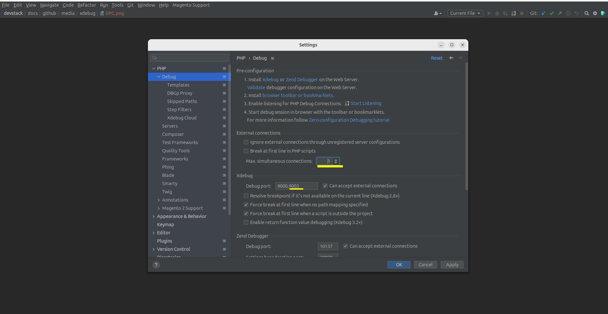
  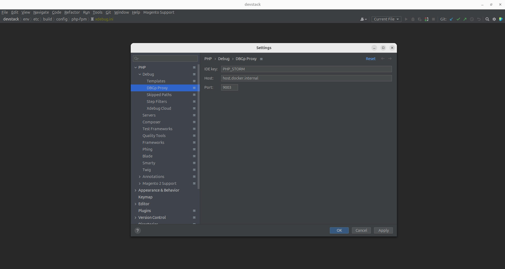
</p>
</details>

### 2. PHP Interpreter and Path Mappings
To ensure proper communication between the `host` and the `php-app` container, you must configure the `remote interpreter` and `path mappings`.

Configuration consists of two main parts:
- the actual `PHP Interpreter` configuration
- the `container` configuration

> [!IMPORTANT]
> 
> Ensure the `PHP Interpreter` version you selected matches your `Adobe Commerce` version (e.g., PHP 8.4 for AC v2.4.8). The interpreter should point to the `php-app` container`s image.

#### Step #1: PHP Interpreter
Connect `PHPStorm` to the Docker `container's PHP binary`.
<details>
<summary>Setup Steps</summary>
  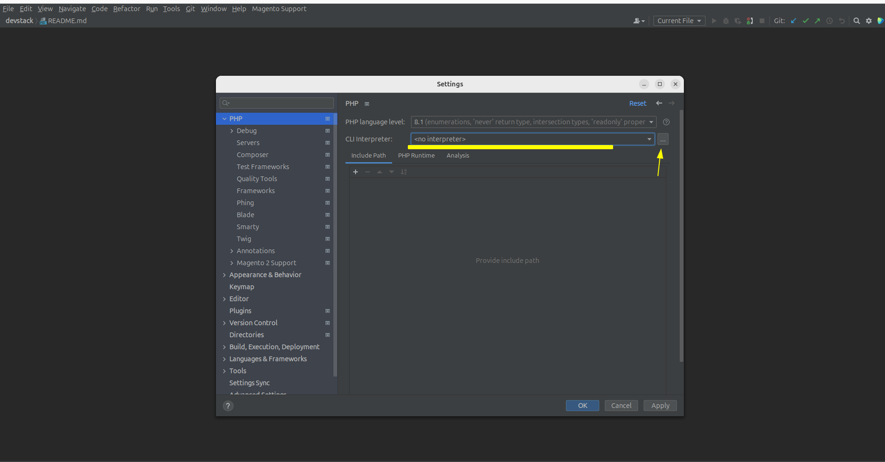
  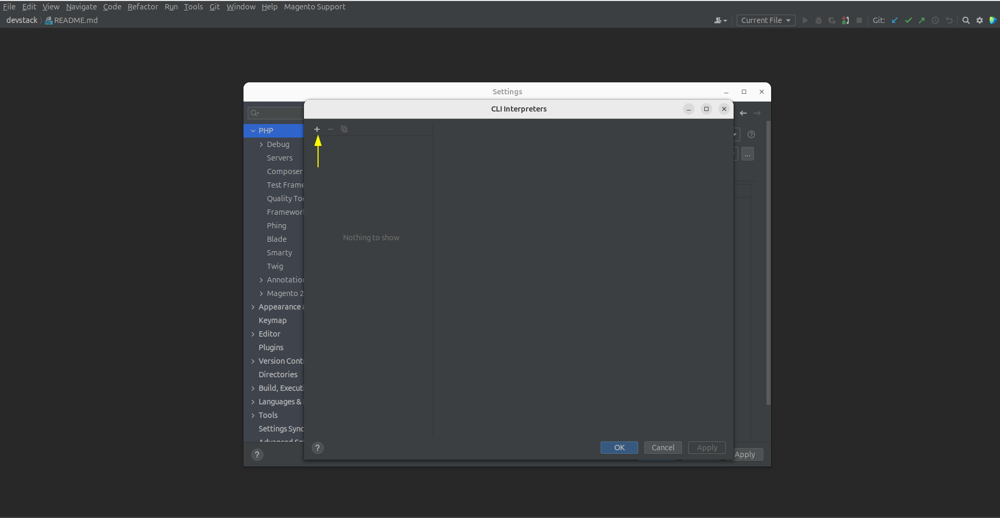
  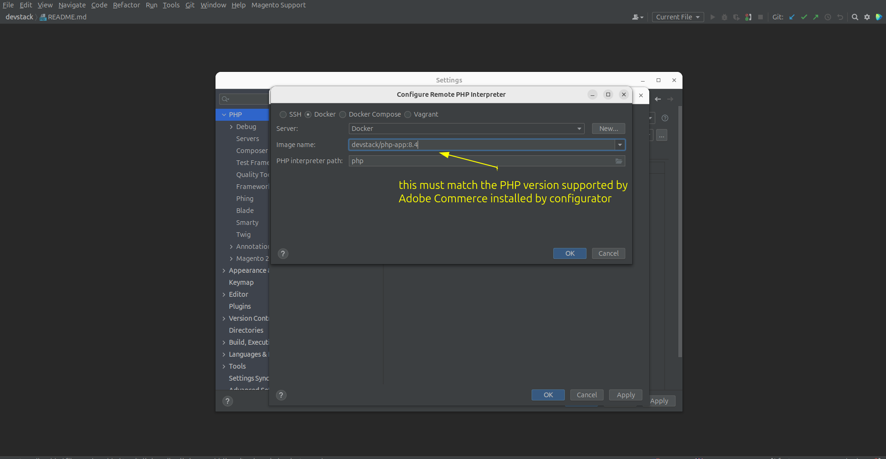
  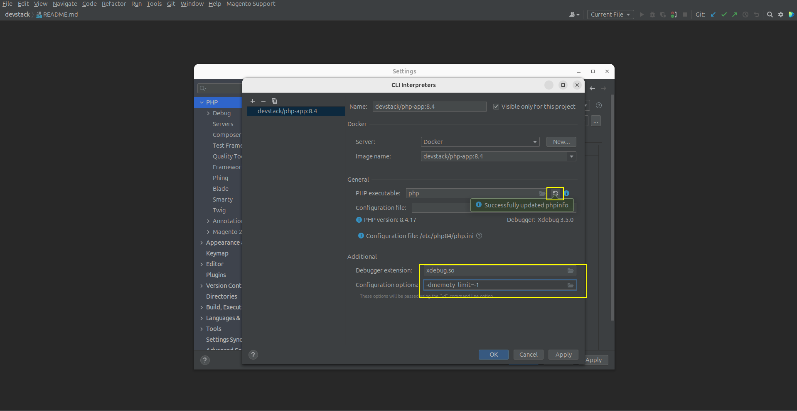
</details>

#### Step #2: Container Configuration
Align path mappings so `PHPStorm` can map the file structure `inside the container`.
<details>
<summary>Setup Steps</summary>
  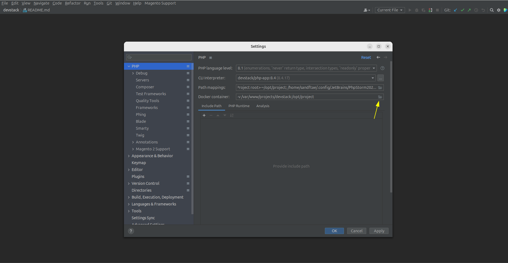
  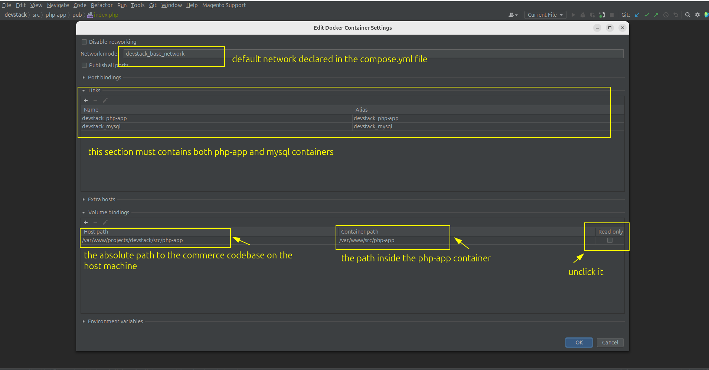
</details>

---

## CLI Debugging

To debug Adobe Commerce `CLI` or custom console commands, you must first complete the [HTTP/HTTPS Request Debugging](#web-request-debugging) setup.

> [!IMPORTANT]
>
> Ensure the `PHP Interpreter` version you selected matches your `Adobe Commerce` version (e.g., PHP 8.4 for AC v2.4.8). The interpreter should point to the `php-app` container`s image.

Just follow screenshots:

<details>
<summary>CLI Configuration Gallery</summary>
  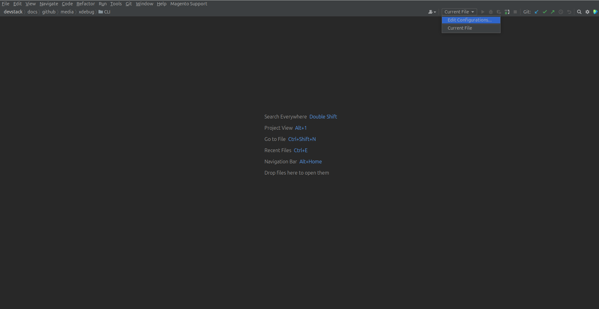
  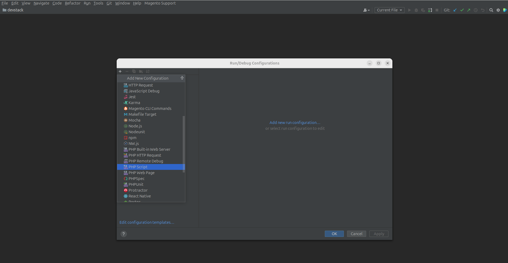
  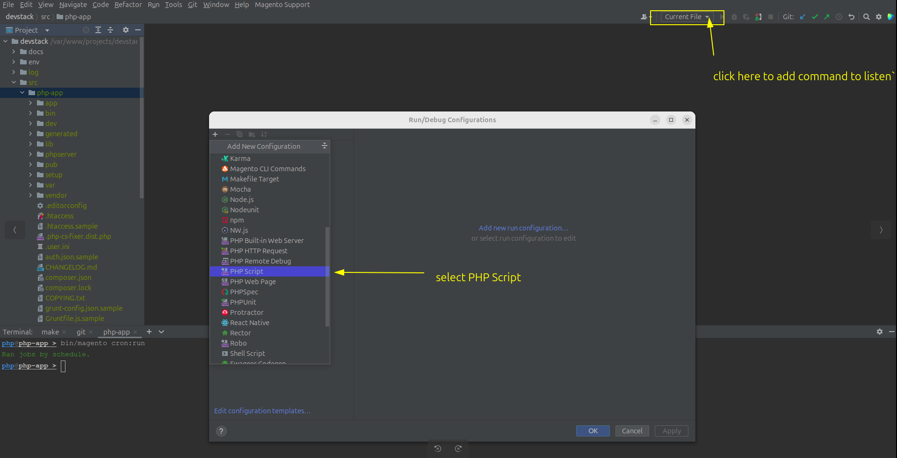
  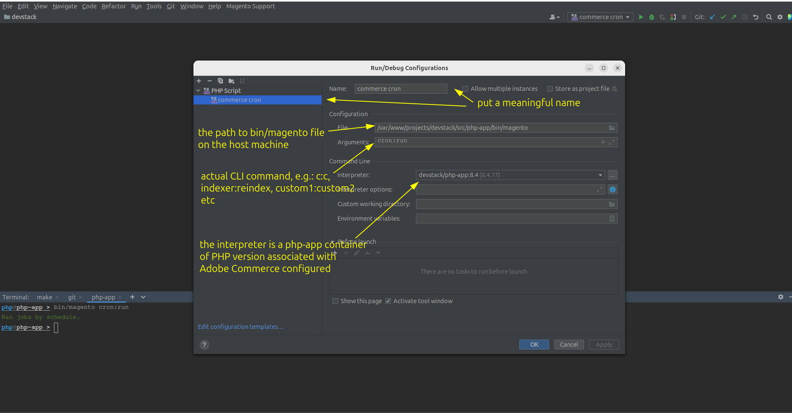
  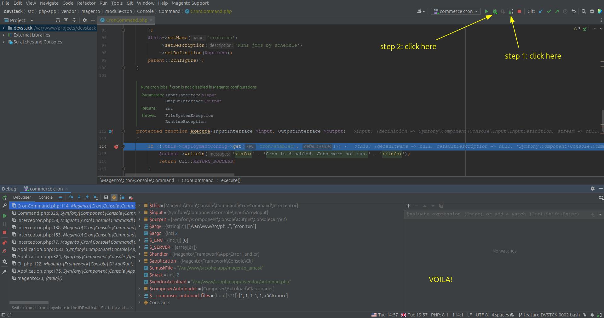
</details>

---

## How to Start Debugging

1.  **Enable Xdebug** in your terminal:
    ```bash
    make xde
    # or 
    make xdebug-enable
    ```
2.  **Start Listening:** click the `Start Listening for PHP Debug Connections` icon in PHPStorm (the `phone` icon)
3.  **Run incoming request:** refresh your browser page to listed `HTTP/HTTPS` request
3.  **Run CLI:**  press `bug` button of the `PHPStorm` to start CLI command. See this screenshot [gallery](#cli-debugging) to find that button
4. **Disable Xdebug** in your terminal:
    ```bash
    make xdd
    # or 
    make xdebug-disable
    ```
